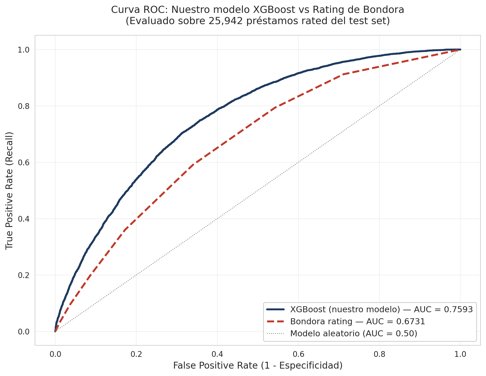
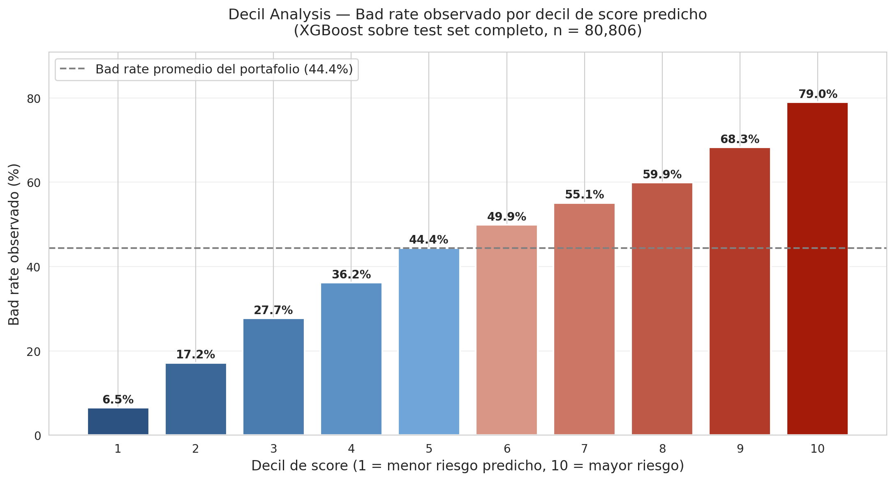

# Credit Scoring with Bondora P2P Loans

> **TL;DR:** XGBoost credit scoring model trained on 404k matured P2P loans. Outperforms Bondora's available rating variable on the validation subset by **+8.6 AUC points** (0.67 → 0.76) and **+49.8% in Gini coefficient**, evaluated on 25,942 loans.



---

## Key Results

| Metric | Our Model (XGBoost) | Bondora Rating | Improvement |
|--------|---------------------|----------------|-------------|
| **AUC** | **0.7593** | 0.6731 | **+8.61 pts** |
| **Gini** | **0.5185** | 0.3462 | **+49.8%** |
| **Lift (decile 10 vs 1)** | **12.2x** | — | — |

Evaluated on a held-out test set of 80,806 loans (25,942 with Bondora rating available for head-to-head comparison).

*Note: the comparison is made against Bondora's published rating variable in the public dataset, which represents their visible scoring output. It does not necessarily reflect any internal models used for fraud, pricing, or collections that may exist but are not publicly available.*

---

## Project Goal

Build a credit scoring model on Bondora's public P2P loan dataset (~915M EUR portfolio across 7 European countries) and demonstrate that it outperforms the platform's published risk rating — the canonical baseline to beat in any credit scoring exercise.

---

## Methodology

### 1. Target definition
The raw `is_default` column captures temporary delinquency, not final outcomes. I built a custom `bad_loan` target that combines **Defaulted + Written Off** loans, and filtered the dataset to **only matured loans** (excluding active and cancelled loans to avoid censored-data bias).

- Original dataset: 737,889 loans, 13.8% apparent default rate
- After maturity filter: **404,028 matured loans**, 44.4% true bad rate

### 2. Data leakage detection
Identified that 17 of 31 columns described post-disbursement events (balances, late payments, etc.). These cannot be used as features because they wouldn't be available at loan-approval time. Also caught `nr_of_payments` as a subtle leakage case via EDA (5.7x mean difference between good/bad loans was a red flag).

**Final feature set: 7 application-time features + 5 country dummies = 12 features**

### 3. Feature engineering
The most impactful single feature: **`income_missing`** — a binary flag created from `combined_income` nulls.
- Loans with declared income: **32.8% bad rate**
- Loans with missing income: **53.1% bad rate**

The absence of income data is a stronger risk signal than most "hard" financial variables.

### 4. Modeling pipeline
- **Baseline:** Logistic Regression (AUC = 0.6982). Used as interpretable benchmark, regulatory standard in real-world banking.
- **Production model:** XGBoost (AUC = 0.7526). Captures non-linear interactions that Logistic Regression cannot.
- **Validation:** Compared XGBoost predictions vs Bondora's published rating on the same 25,942-loan subset.

### 5. Score generation (auxiliary output)
As a presentation layer, the model's probability output was also translated into a FICO-style numeric score using the standard industry transformation `Score = Offset − Factor × ln(odds)`. This produces a more business-readable output for stakeholder communication but does not affect the underlying model performance.

### 6. Validation analysis
- ROC curve comparison (XGBoost dominates Bondora's published rating at every threshold)
- Decile analysis (12.2x lift between worst and best decile)

---

## Decile Analysis



The bad rate progresses cleanly from 6.5% in decile 1 (lowest predicted risk) to 79.0% in decile 10 (highest predicted risk) — a 12.2x lift, well above the 8x threshold considered "excellent" in industry benchmarks.

**Business interpretation:** the model enables risk-based pricing and segmentation. Deciles 1-4 represent ~32k loans with average ~22% bad rate (the lower-risk core, potentially attractive for risk-based pricing). Deciles 8-10 represent ~24k loans with ~69% bad rate (the loss-generating tail, candidates for tighter underwriting or collateralized lending).

---

## Tech Stack

- **Python 3.11** (Google Colab)
- **pandas** — data manipulation
- **scikit-learn** — Logistic Regression, train/test split, scaling, metrics
- **XGBoost** — gradient boosted trees
- **matplotlib / seaborn** — visualization
- **Power BI** — final dashboard

---

## Repository Structure

```
.
├── README.md
├── Bondora_Credit_Scoring.ipynb    # Main notebook (end-to-end)
├── roc_comparison.png              # ROC curve comparison
├── decil_analysis.png              # Decile analysis chart
├── executive_memo.pdf              # 1-page executive summary
├── data/
│   └── README.md                   # Instructions to download dataset
└── outputs/
    ├── predicciones_test.csv       # Test set predictions with scores
    ├── decil_stats.csv             # Decile-level statistics
    └── resumen_metricas.csv        # Key metrics summary
```

---

## Key Concepts Demonstrated

- **Target leakage detection** (excluded 17 post-event variables)
- **Censored data treatment** (matured-loans-only filter)
- **Informative missingness** (income_missing flag as predictor)
- **Stratified train/test split**
- **Imbalanced classification metrics** (AUC, Gini, lift)
- **Model interpretability** (LR coefficients vs XGBoost feature importance)
- **Benchmarking against industry baseline** (Bondora's published rating)

---

## Limitations & Caveats

A few honest limitations worth noting:

- The comparison is against the **published rating variable**, not Bondora's full internal risk infrastructure.
- The 12 application-time features are a limited set; richer credit bureau data (which Bondora likely uses) would probably narrow the gap.
- No out-of-time validation was performed: the model is evaluated on a random stratified split, not on a chronologically separated holdout. A production-grade validation should test for temporal drift.
- The score scale is calibrated to this specific high-risk portfolio; absolute score values are not directly comparable to FICO or other consumer credit scores.

---

## Dataset

Bondora publishes their full loan-level dataset publicly at: [bondora.com/en/public-statistics](https://bondora.com/en/public-statistics)

The version used here is the "investor" dataset (31 columns, ~150 MB), containing all loans from 2009 to 2025 across Estonia, Finland, Spain, Netherlands, Latvia, Denmark, and Slovakia.

---

## How to Reproduce

1. Download the dataset from Bondora's public statistics page.
2. Place the file in `/content/drive/MyDrive/Codigos/loan_dataset_investor.xlsx` (or adjust the path in the notebook).
3. Open `Bondora_Credit_Scoring.ipynb` in Google Colab or Jupyter.
4. Run all cells. Total execution time: ~5 minutes.

---

## Contact

**Marcelo Tolentino Vega**
Bachelor in Chemical Engineering, UNMSM (top third of class)

- LinkedIn: [@marcelotolvega](https://linkedin.com/in/marcelotolvega)
- Email: marcelotolvega@gmail.com

---

*Project completed as part of personal portfolio. Stanford ML Specialization and Wharton Business and Financial Modeling Specialization, 2026.*
